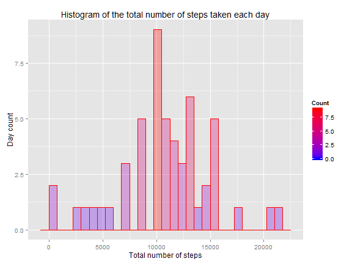

Peer Assessment 1
=================

This document fulfills the requirements for the peer assessment 1 assignment,
for Coursera course [Reproducible Research](https://class.coursera.org/repdata-035).

## Introduction

We take the problem description verbatim from the original document.

> It is now possible to collect a large amount of data about personal
> movement using activity monitoring devices such as a
> [Fitbit](http://www.fitbit.com), [Nike
> Fuelband](http://www.nike.com/us/en_us/c/nikeplus-fuelband), or
> [Jawbone Up](https://jawbone.com/up). These type of devices are part of
> the "quantified self" movement -- a group of enthusiasts who take
> measurements about themselves regularly to improve their health, to
> find patterns in their behavior, or because they are tech geeks. But
> these data remain under-utilized both because the raw data are hard to
> obtain and there is a lack of statistical methods and software for
> processing and interpreting the data.
>
> This assignment makes use of data from a personal activity monitoring
> device. This device collects data at 5 minute intervals through out the
> day. The data consists of two months of data from an anonymous
> individual collected during the months of October and November, 2012
> and include the number of steps taken in 5 minute intervals each day.

## Data

Data archive is included into the repository. As an alternative, data could
be downloaded from [Activity monitoring data](https://d396qusza40orc.cloudfront.net/repdata%2Fdata%2Factivity.zip).

Data description taken verbatim from the assignment.

> The variables included in this dataset are:
>
> * **steps**: Number of steps taking in a 5-minute interval (missing
>     values are coded as `NA`)
>
> * **date**: The date on which the measurement was taken in YYYY-MM-DD
>     format
>
> * **interval**: Identifier for the 5-minute interval in which
>     measurement was taken
>
>
> The dataset is stored in a comma-separated-value (CSV) file and there
> are a total of 17,568 observations in this
> dataset.

## Assignment

There are multiple parts for this assignment. This document will answer all
questions raised as part of an assignment. Document to be processed by **knitr**
and output will be valid HTML file. **R** code in the document will be echoed
so reviewer shall be able to read the code. Each section below will answer one
or more questions raised in the assignment.

## Loading required **R** packages

First, we check if all necessary packages are installed. If not, they
will be installed and loaded.


```r
check_and_install <- function( packname ) {
    # given package name, check if it is installed
    # if not, download and install
    if ( packname %in% rownames(installed.packages()) == FALSE ) {
        install.packages( packname )
    }
}

check_and_install("data.table")
check_and_install("xtable")
check_and_install("ggplot2")

require("data.table")
```

```
## Loading required package: data.table
```

```r
require("xtable")
```

```
## Loading required package: xtable
```

```r
require("ggplot2")
```

```
## Loading required package: ggplot2
## Loading required package: methods
```

## Loading and preprocessing the data

Data as a ZIP archive are located in the same directory as the **R** markdown. Thus,
first we unpack archive and extract CSV file.
Then, we read it and check for consistency. Last, we convert date string to
*Date* and set primary key. Essential features of the [data.table](https://cran.r-project.org/web/packages/data.table/index.html)
package will be used.

### Unpacking and loading data


```r
unzip("activity.zip", "activity.csv")

dt <- fread("activity.csv")
str(dt)
```

```
## Classes 'data.table' and 'data.frame':	17568 obs. of  3 variables:
##  $ steps   : int  NA NA NA NA NA NA NA NA NA NA ...
##  $ date    : chr  "2012-10-01" "2012-10-01" "2012-10-01" "2012-10-01" ...
##  $ interval: int  0 5 10 15 20 25 30 35 40 45 ...
##  - attr(*, ".internal.selfref")=<externalptr>
```

```r
head(dt)
```

```
##    steps       date interval
## 1:    NA 2012-10-01        0
## 2:    NA 2012-10-01        5
## 3:    NA 2012-10-01       10
## 4:    NA 2012-10-01       15
## 5:    NA 2012-10-01       20
## 6:    NA 2012-10-01       25
```

```r
tail(dt)
```

```
##    steps       date interval
## 1:    NA 2012-11-30     2330
## 2:    NA 2012-11-30     2335
## 3:    NA 2012-11-30     2340
## 4:    NA 2012-11-30     2345
## 5:    NA 2012-11-30     2350
## 6:    NA 2012-11-30     2355
```

One can see we have three columns as *int*, *character* and *int*.

### Check for consistency


```r
dims <- dim(dt)

if (dims[1] != 17568) {
    stop("Bad number of rows, should be 17568, bailing out!")
}

if (dims[2] != 3) {
    stop("Bad number of columns, should be 3, bailing out!")
}
```

If we make it so far, data are consistent with our expectations.

### Data preprocessing

First, we prefer to convert second column to proper date.


```r
dt <- dt[ , date := as.Date(date, "%Y-%m-%d")]
```

Second, we make


```r
dt <- dt[ , steps := as.numeric(steps)]

str(dt)
```

```
## Classes 'data.table' and 'data.frame':	17568 obs. of  3 variables:
##  $ steps   : num  NA NA NA NA NA NA NA NA NA NA ...
##  $ date    : Date, format: "2012-10-01" "2012-10-01" ...
##  $ interval: int  0 5 10 15 20 25 30 35 40 45 ...
##  - attr(*, ".internal.selfref")=<externalptr>
```

```r
head(dt)
```

```
##    steps       date interval
## 1:    NA 2012-10-01        0
## 2:    NA 2012-10-01        5
## 3:    NA 2012-10-01       10
## 4:    NA 2012-10-01       15
## 5:    NA 2012-10-01       20
## 6:    NA 2012-10-01       25
```

```r
tail(dt)
```

```
##    steps       date interval
## 1:    NA 2012-11-30     2330
## 2:    NA 2012-11-30     2335
## 3:    NA 2012-11-30     2340
## 4:    NA 2012-11-30     2345
## 5:    NA 2012-11-30     2350
## 6:    NA 2012-11-30     2355
```

Last step is to set primary key for speedy evaluation


```r
setkey(dt, date)
str(dt)
```

```
## Classes 'data.table' and 'data.frame':	17568 obs. of  3 variables:
##  $ steps   : num  NA NA NA NA NA NA NA NA NA NA ...
##  $ date    : Date, format: "2012-10-01" "2012-10-01" ...
##  $ interval: int  0 5 10 15 20 25 30 35 40 45 ...
##  - attr(*, ".internal.selfref")=<externalptr> 
##  - attr(*, "sorted")= chr "date"
```

## What is mean total number of steps taken per day?

Here we will try to answer several question, taken verbatim from the assignment.

> ### Calculate the total number of steps taken per day

We will group data table by date, and then aggregate the number of steps.


```r
dt.steps_by_date <- dt[, sum(steps), by=date]
setnames(dt.steps_by_date, "V1", "steps")

str(dt.steps_by_date)
```

```
## Classes 'data.table' and 'data.frame':	61 obs. of  2 variables:
##  $ date : Date, format: "2012-10-01" "2012-10-02" ...
##  $ steps: num  NA 126 11352 12116 13294 ...
##  - attr(*, "sorted")= chr "date"
##  - attr(*, ".internal.selfref")=<externalptr>
```

```r
head(dt.steps_by_date)
```

```
##          date steps
## 1: 2012-10-01    NA
## 2: 2012-10-02   126
## 3: 2012-10-03 11352
## 4: 2012-10-04 12116
## 5: 2012-10-05 13294
## 6: 2012-10-06 15420
```

```r
tail(dt.steps_by_date)
```

```
##          date steps
## 1: 2012-11-25 11834
## 2: 2012-11-26 11162
## 3: 2012-11-27 13646
## 4: 2012-11-28 10183
## 5: 2012-11-29  7047
## 6: 2012-11-30    NA
```

> ### Make a histogram of the total number of steps taken each day

To make a histogram, we will use **ggplot2** package functionality.
We will make it a gradient plot to look a bit nicer. Also, we would
like to see how bin width affects histrogram appearance.

First, low resolution histogram with bin width equal to 1000.


```r
p <- ggplot(dt.steps_by_date, aes(x = steps)) +
       geom_histogram(alpha=0.3, binwidth=1000,
                     col="red",
                     aes(fill=..count..)) +
       scale_fill_gradient("Count", low = "blue", high = "red") +
       labs(title="Histogram of the total number of steps taken each day") +
       labs(x="Total number of steps", y="Day count")
print(p)
```

 

Then, medium resolution histogram with bin width equal to 750.


```r
p <- ggplot(dt.steps_by_date, aes(x = steps)) +
       geom_histogram(alpha=0.3, binwidth=750,
                     col="red",
                     aes(fill=..count..)) +
       scale_fill_gradient("Count", low = "blue", high = "red") +
       labs(title="Histogram of the total number of steps taken each day") +
       labs(x="Total number of steps", y="Day count")
print(p)
```

 

Last histogram is a fine one, with bin width equal to 500.


```r
p <- ggplot(dt.steps_by_date, aes(x = steps)) +
       geom_histogram(alpha=0.3, binwidth=500,
                     col="red",
                     aes(fill=..count..)) +
       scale_fill_gradient("Count", low = "blue", high = "red") +
       labs(title="Histogram of the total number of steps taken each day") +
       labs(x="Total number of steps", y="Day count")
print(p)
```

 

> ### Calculate and report the mean and median of the total number of steps taken per day

We will calculate the mean and median of the total number of steps taken per day.
Because data still has *NA* values, we will filter them out.
To make a nice table, we will be using [xtable](https://cran.r-project.org/web/packages/xtable/index.html)
package.

First, we make data table *tbl* filtering out *NA* values


```r
tbl <- dt.steps_by_date[, list(N = .N,  mean = mean(steps, na.rm=TRUE), median = median(steps, na.rm=TRUE))]
str(tbl)
```

```
## Classes 'data.table' and 'data.frame':	1 obs. of  3 variables:
##  $ N     : int 61
##  $ mean  : num 10766
##  $ median: num 10765
##  - attr(*, ".internal.selfref")=<externalptr>
```

Then we print *tbl* as a nice embedded HTML table.


```r
print(xtable(tbl), type="html", include.rownames=FALSE)
```

<!-- html table generated in R 3.2.3 by xtable 1.8-0 package -->
<!-- Sun Dec 20 14:50:56 2015 -->
<table border=1>
<tr> <th> N </th> <th> mean </th> <th> median </th>  </tr>
  <tr> <td align="right">  61 </td> <td align="right"> 10766.19 </td> <td align="right"> 10765.00 </td> </tr>
   </table>

## What is the average daily activity pattern?

There are two questions to be answered in this chapter of the assignment.

> ### Make a time series plot of the 5-minute interval (x-axis) and the average number of steps taken, averaged across all days (y-axis)

First, we make new data table, grouped by interval with average number of steps taken.
Of course, *NA* values will be filtered out.


```r
dt.steps_by_interval <- dt[, list(mean = mean(steps, na.rm=TRUE)), by=interval]
str(dt.steps_by_interval)
```

```
## Classes 'data.table' and 'data.frame':	288 obs. of  2 variables:
##  $ interval: int  0 5 10 15 20 25 30 35 40 45 ...
##  $ mean    : num  1.717 0.3396 0.1321 0.1509 0.0755 ...
##  - attr(*, ".internal.selfref")=<externalptr>
```

Now making linear plot, again using **ggplot2** as plotting library.


```r
p <- ggplot(dt.steps_by_interval, aes(x=interval, y=mean)) +
	geom_line(size=1, colour="#CC6666") +
    labs(title="Average number of steps per interval") +
    labs(x="Interval", y="Average number of steps")
print(p)
```

 

> ### Which 5-minute interval, on average across all the days in the dataset, contains the maximum number of steps?

To find this value, first we sort our data table by average number of steps in
the descending order, and thus first row will contain asked value in the
*interval* column.


```r
q <- dt.steps_by_interval[order(-mean)]
str(q)
```

```
## Classes 'data.table' and 'data.frame':	288 obs. of  2 variables:
##  $ interval: int  835 840 850 845 830 820 855 815 825 900 ...
##  $ mean    : num  206 196 183 180 177 ...
##  - attr(*, ".internal.selfref")=<externalptr>
```

```r
max_interval <- q[1, interval]
```

The 5-minute interval, on average across all the days in the dataset,
with the largest number of steps is 835.
It is consistent with the displayed graph.

## Imputing missing values

There are a number of days/intervals where there are missing
values (coded as `NA`). The presence of missing days may introduce
bias into some calculations or summaries of the data.

> ### Calculate and report the total number of missing values in the dataset

We use **is.na()** function to get logical vector of missing values.
Then we sum it to produce asked value.


```r
q <- is.na(dt$steps)
mia_steps <- sum(q)
```

Thus, total number of missing values is equal to 2304.

Just in case, checking *NA* in the *date* and *interval* columns


```r
q <- is.na(dt$date)
mia_date <- sum(q)
```

Number of missing dates is equal to 0.


```r
q <- is.na(dt$interval)
mia_interval <- sum(q)
```

Number of missing intervals is equal to 0.


> ### Devise a strategy for filling in all of the missing values in the dataset.


> ### Create a new dataset that is equal to the original dataset but with the missing data filled in.

> ### Make a histogram of the total number of steps taken each day and Calculate and report the **mean** and **median** total number of steps taken per day. Do these values differ from the estimates from the first part of the assignment? What is the impact of imputing missing data on the estimates of the total daily number of steps?

